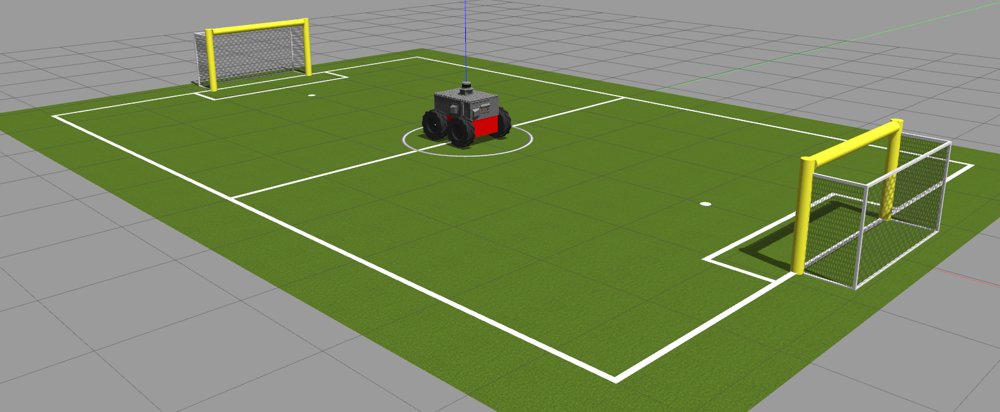

# Exercise 1 in ETH Zurich
This is the solution to exercise 1, course Eth zurich. 

## Directory Structure
* [set_speed/](./src/set_speed)
  * [include/](./src/set_speed/include)
    * [set_speed/](./src/set_speed/include/set_speed)
      * [setSpeedPub.hpp](./src/set_speed/include/set_speed/setSpeedPub.hpp)
  * [launch/](./src/set_speed/launch)
    * [set_speed.launch](./src/set_speed/launch/set_speed.launch)
  * [src/](./src/set_speed/src)
    * [pub_node.cpp](./src/set_speed/src/pub_node.cpp)
    * [setSpeedPub.cpp](./src/set_speed/src/setSpeedPub.cpp)
  * [worlds/](./src/set_speed/worlds)
    * [big_map_summer_school.world](./src/set_speed/worlds/big_map_summer_school.world)
    * [empty.world](./src/set_speed/worlds/empty.world)
    * [planner_tutorial.world](./src/set_speed/worlds/planner_tutorial.world)
  * [CMakeLists.txt](./src/set_speed/CMakeLists.txt)
  * [package.xml](./src/set_speed/package.xml)
* [smb_control/](./src/smb_control)
* [smb_description/](./src/smb_description)
* [smb_gazebo/](./src/smb_gazebo)

## Exercise Description

In this exercise, it's required the following:  
1. Send velocity command to robot:  
    -  use the launch file to start the simulation:
    `roslaunch smb_gazebo smb_gazebo.launch`
    - show topic message info:
    `rostopic type /cmd_vel | rosmsg show`
    - publish message:
    `rostopic pub /cmd_vel geometry_msgs/Twist -r 1 '[2.0, .0, .0]' '[.0, .0, 1.0]'`

2.  Use `teleop_twist_keyboard`:  
Use keyboard to control the rrobot  
    - use the launch file to start the simulation:  
      `roslaunch smb_gazebo smb_gazebo.launch` 

    - Run ros-node to activate `teleop_twist_keyboard`:   
      `rosrun teleop_twist_keyboard teleop_twist_keyboard.py`

3. Write launch file to create a simulation  :  
I created a package `set_speed` for it with a ros node to control the robot.

4. The simulation output on Gazebo :
    

## Dependencies for Running Locally
* cmake >= 2.8
  * All OSes: [click here for installation instructions](https://cmake.org/install/)
* make >= 4.1 (Linux, Mac), 3.81 (Windows)
  * Linux: make is installed by default on most Linux distros
  * Mac: [install Xcode command line tools to get make](https://developer.apple.com/xcode/features/)
  * Windows: [Click here for installation instructions](http://gnuwin32.sourceforge.net/packages/make.htm)
* gcc/g++ >= 5.4
  * Linux: gcc / g++ is installed by default on most Linux distros
  * Mac: same deal as make - [install Xcode command line tools](https://developer.apple.com/xcode/features/)
  * Windows: recommend using [MinGW](http://www.mingw.org/)
* ROS  >= (Kinetic/Melodic/Noetic)
  * For all platform and OS [Click here for installation instructions](http://wiki.ros.org/ROS/Installation)

## Basic Build Instructions

1. Clone this repo.
2. Inside cloned folder `catkin_make`
3. Then source the workspace: `source devel/setup.bash`
4. Then run the launch files: `roslaunch set_speed set_speed.launch`

