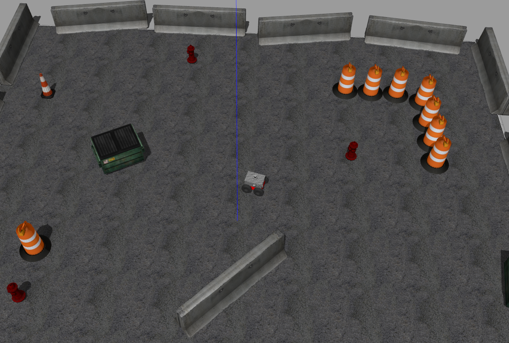
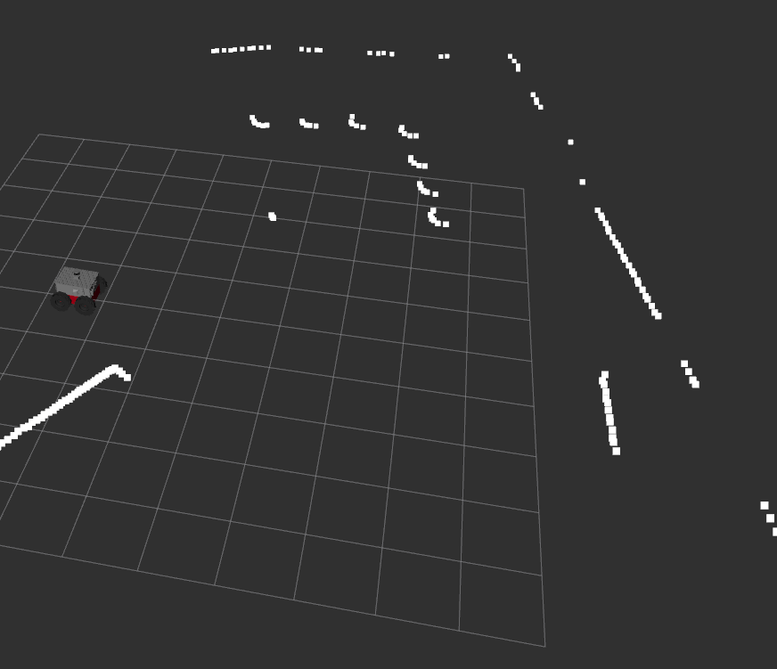

# Exercise 2 in ETH Zurich
This is the solution to exercise 2, course Eth zurich. 

## Directory Structure
* [config/](./smb_highlevel_controller/config)
  * [default.yaml](./smb_highlevel_controller/config/default.yaml)
* [include/](./smb_highlevel_controller/include)
  * [smb_highlevel_controller/](./smb_highlevel_controller/include/smb_highlevel_controller)
    * [smb_highlevel_controller.hpp](./smb_highlevel_controller/include/smb_highlevel_controller/smb_highlevel_controller.hpp)
* [launch/](./smb_highlevel_controller/launch)
  * [smb_highlevel_controller.launch](./smb_highlevel_controller/launch/smb_highlevel_controller.launch)
* [src/](./smb_highlevel_controller/src)
  * [smb_highlevel_controller.cpp](./smb_highlevel_controller/src/smb_highlevel_controller.cpp)
  * [smb_highlevel_controller_node.cpp](./smb_highlevel_controller/src/smb_highlevel_controller_node.cpp)
* [CMakeLists.txt](./smb_highlevel_controller/CMakeLists.txt)
* [package.xml](./smb_highlevel_controller/package.xml)
* [smb_control/](./src/smb_control)
* [smb_description/](./src/smb_description)
* [smb_gazebo/](./src/smb_gazebo)

## Exercise Description

In this exercise, it's required the following:  
1. Create the package smb_highlevel_controller from scratch using catkin_create_pkg:  
    `catkin_create_pkg  smb_highlevel_controller roscpp sensor_msgs`

2.  Add a parameter file with topic name and queue size for the subscriber of the topic`:  
    can be found here --> * [default.yaml](./smb_highlevel_controller/config/default.yaml)

3. Create a callback method for that subscriber which outputs the smallest distance
measurement from the vector ranges in the message of the laser scanner:  
    The implementaion can be found here --> * [smb_highlevel_controller.cpp](./smb_highlevel_controller/src/smb_highlevel_controller.cpp)

4. Create launch file to run smb simulation and run the smb_highlevel_controller node with parameter :  
    The launch file can be found here -->* [smb_highlevel_controller.launch](./smb_highlevel_controller/launch/smb_highlevel_controller.launch)

5. Configure RVIZ and show laser scanner :
  - Gazebo output:  
    

  - Rviz output:  
    

## Dependencies for Running Locally
* cmake >= 2.8
  * All OSes: [click here for installation instructions](https://cmake.org/install/)
* make >= 4.1 (Linux, Mac), 3.81 (Windows)
  * Linux: make is installed by default on most Linux distros
  * Mac: [install Xcode command line tools to get make](https://developer.apple.com/xcode/features/)
  * Windows: [Click here for installation instructions](http://gnuwin32.sourceforge.net/packages/make.htm)
* gcc/g++ >= 5.4
  * Linux: gcc / g++ is installed by default on most Linux distros
  * Mac: same deal as make - [install Xcode command line tools](https://developer.apple.com/xcode/features/)
  * Windows: recommend using [MinGW](http://www.mingw.org/)
* ROS  >= (Kinetic/Melodic/Noetic)
  * For all platform and OS [Click here for installation instructions](http://wiki.ros.org/ROS/Installation)

## Basic Build Instructions

1. Clone this repo.
2. Inside cloned folder `catkin_make`
3. Then source the workspace: `source devel/setup.bash`
4. Then run the launch files: `roslaunch smb_highlevel_controller smb_highlevel_controller.launch`