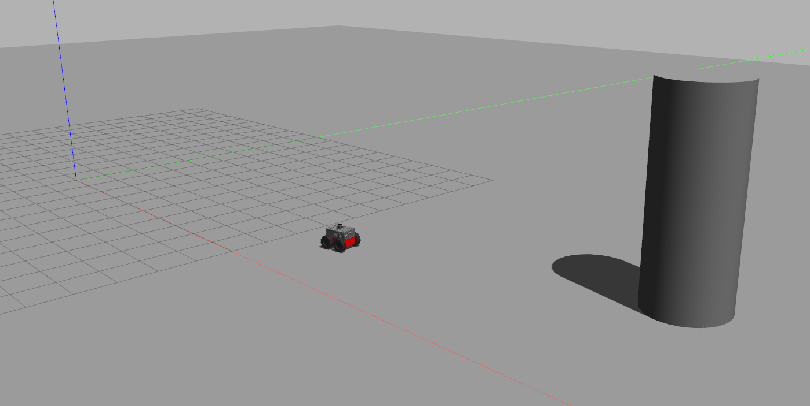
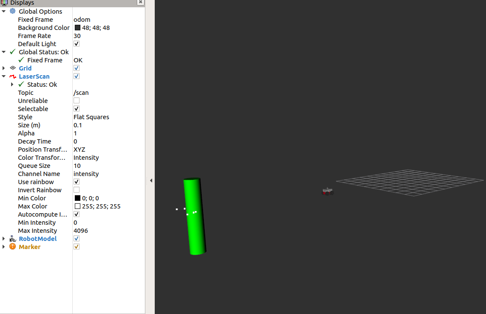

# Exercise 3 in ETH Zurich
This is the solution to exercise 3, course Eth zurich. 

## Directory Structure
# smb_highlevel_controller

* [config/](./smb_highlevel_controller/config)
  * [default.yaml](./smb_highlevel_controller/config/default.yaml)
* [include/](./smb_highlevel_controller/include)
  * [smb_highlevel_controller/](./smb_highlevel_controller/include/smb_highlevel_controller)
    * [math.hpp](./smb_highlevel_controller/include/smb_highlevel_controller/math.hpp)
    * [smb_highlevel_controller.hpp](./smb_highlevel_controller/include/smb_highlevel_controller/smb_highlevel_controller.hpp)
    * [smb_highlevel_controller_pid.hpp](./smb_highlevel_controller/include/smb_highlevel_controller/smb_highlevel_controller_pid.hpp)
* [launch/](./smb_highlevel_controller/launch)
  * [smb_highlevel_controller.launch](./smb_highlevel_controller/launch/smb_highlevel_controller.launch)
* [smb_rviz/](./smb_highlevel_controller/smb_rviz)
  * [smb_highLevel_cont_rviz.rviz](./smb_highlevel_controller/smb_rviz/smb_highLevel_cont_rviz.rviz)
* [src/](./smb_highlevel_controller/src)
  * [smb_highlevel_controller.cpp](./smb_highlevel_controller/src/smb_highlevel_controller.cpp)
  * [smb_highlevel_controller_node.cpp](./smb_highlevel_controller/src/smb_highlevel_controller_node.cpp)
  * [smb_highlevel_controller_pid.cpp](./smb_highlevel_controller/src/smb_highlevel_controller_pid.cpp)
* [CMakeLists.txt](./smb_highlevel_controller/CMakeLists.txt)
* [package.xml](./smb_highlevel_controller/package.xml)

## Exercise Description

In this exercise, it's required the following:  
1. Adapt the launch file to remove keyboard and add singlePillar.world:  
    The adapted launch file can be found here --> * [smb_highlevel_controller.launch](./smb_highlevel_controller/launch/smb_highlevel_controller.launch)

2.  Extract the position of the pillar from the laser scan with respect to the robot:  
    can be found here -->  * [smb_highlevel_controller.cpp](./smb_highlevel_controller/src/smb_highlevel_controller.cpp) in Function `LaserCallback()`.

3. Create a publisher on the topic **/cmd_vel** and controller for robot    heading and velocity to hit the pillar:  
    - The implementaion can be found here --> * [smb_highlevel_controller.cpp](./smb_highlevel_controller/src/smb_highlevel_controller.cpp)in Functions `linearVelocityUpdate()`, `angularVelocityUpdate()` and `robotCmdPublish()`.
    The PID controller for robot heading implemented here --> * [smb_highlevel_controller_pid.cpp](./smb_highlevel_controller/src/smb_highlevel_controller_pid.cpp)

    - To ensure that the pillar is well visible in the
      laser scan, set the ​ laser_scan_min_height ​ to -0.2 and ​ laser_scan_max_height ​ to 1.0.

    - Gazebo output:  
          

4. Publish a visualization marker for RViz that shows the estimated position of the pillar.(easy) Publish the point in the sensor frame (​rslidar ) as an RViz marker :  
    - The implementaion can be found here --> * [smb_highlevel_controller.cpp](./smb_highlevel_controller/src/smb_highlevel_controller.cpp)in Functions `rvizInit()`, `rvizUpdate()` and `rvizPublishData()`.

    - Rviz configuration are saved here -->   * [smb_highLevel_cont_rviz.rviz](./smb_highlevel_controller/smb_rviz/smb_highLevel_cont_rviz.rviz)

    - Rviz output:  
         

## Dependencies for Running Locally
* cmake >= 2.8
  * All OSes: [click here for installation instructions](https://cmake.org/install/)
* make >= 4.1 (Linux, Mac), 3.81 (Windows)
  * Linux: make is installed by default on most Linux distros
  * Mac: [install Xcode command line tools to get make](https://developer.apple.com/xcode/features/)
  * Windows: [Click here for installation instructions](http://gnuwin32.sourceforge.net/packages/make.htm)
* gcc/g++ >= 5.4
  * Linux: gcc / g++ is installed by default on most Linux distros
  * Mac: same deal as make - [install Xcode command line tools](https://developer.apple.com/xcode/features/)
  * Windows: recommend using [MinGW](http://www.mingw.org/)
* ROS  >= (Kinetic/Melodic/Noetic)
  * For all platform and OS [Click here for installation instructions](http://wiki.ros.org/ROS/Installation)

## Basic Build Instructions

1. Clone this repo.
2. Inside cloned folder `catkin_make`
3. Then source the workspace: `source devel/setup.bash`
4. Then run the launch files: `roslaunch smb_highlevel_controller smb_highlevel_controller.launch`