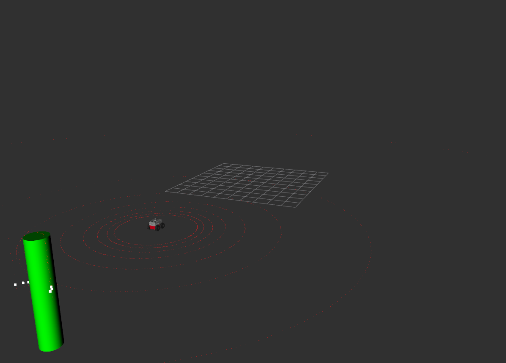
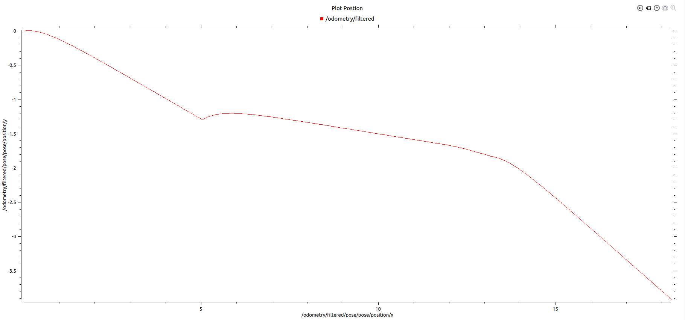
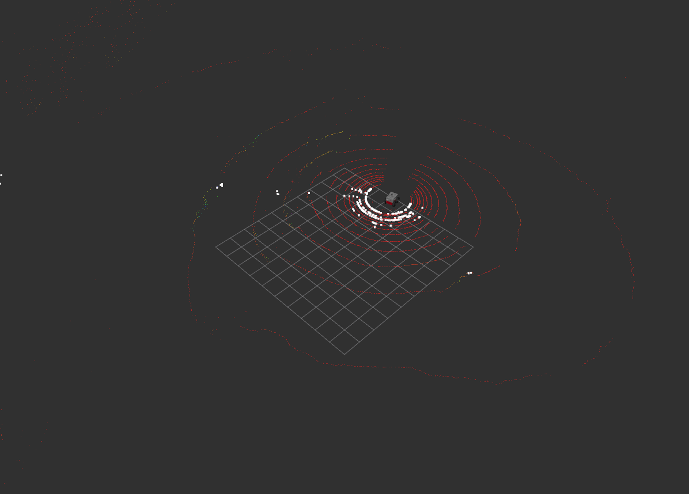
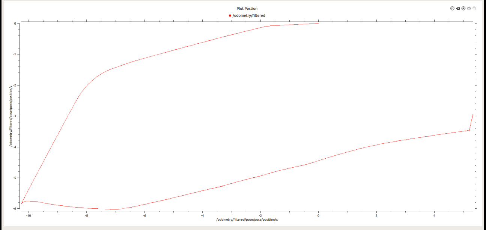

# Exercise 4 in ETH Zurich
This is the solution to exercise 4, course Eth zurich. 

## Directory Structure
# smb_highlevel_controller

* [smb_highlevel_controller/](src/smb_highlevel_controller)
  * [config/](src/smb_highlevel_controller/config)
    * [default.yaml](src/smb_highlevel_controller/config/default.yaml)
  * [include/](src/smb_highlevel_controller/include)
    * [smb_highlevel_controller/](src/smb_highlevel_controller/include/smb_highlevel_controller)
      * [math.hpp](src/smb_highlevel_controller/include/smb_highlevel_controller/math.hpp)
      * [smb_highlevel_controller.hpp](src/smb_highlevel_controller/include/smb_highlevel_controller/smb_highlevel_controller.hpp)
      * [smb_highlevel_controller_pid.hpp](src/smb_highlevel_controller/include/smb_highlevel_controller/smb_highlevel_controller_pid.hpp)
  * [launch/](src/smb_highlevel_controller/launch)
    * [smb_highlevel_controller.launch](src/smb_highlevel_controller/launch/smb_highlevel_controller.launch)
    * [smb_highlevel_controller_bag.launch](src/smb_highlevel_controller/launch/smb_highlevel_controller_bag.launch)
  * [smb_rviz/](src/smb_highlevel_controller/smb_rviz)
    * [smb_highLevel_cont_rviz.rviz](src/smb_highlevel_controller/smb_rviz/smb_highLevel_cont_rviz.rviz)
    * [rqt_multiplot.xml](src/smb_highlevel_controller/smb_rviz/rqt_multiplot.xml)
  * [src/](src/smb_highlevel_controller/src)
    * [smb_highlevel_controller.cpp](src/smb_highlevel_controller/src/smb_highlevel_controller.cpp)
    * [smb_highlevel_controller_node.cpp](src/smb_highlevel_controller/src/smb_highlevel_controller_node.cpp)
    * [smb_highlevel_controller_pid.cpp](src/smb_highlevel_controller/src/smb_highlevel_controller_pid.cpp)
  * [CMakeLists.txt](src/smb_highlevel_controller/CMakeLists.txt)
  * [package.xml](src/smb_highlevel_controller/package.xml)

## Exercise Description

In this exercise, it's required the following:  
1. use **rqt_multiplot** with exercise 3 to plot `/odometry/filtered`:  
    - The adapted launch file can be found here --> * [smb_highlevel_controller.launch](src/smb_highlevel_controller/launch/smb_highlevel_controller.launch)

    - Configuration of **rqt_multiplot** can be found here --> * [rqt_multiplot.xml](src/smb_highlevel_controller/smb_rviz/rqt_multiplot.xml)

    - Rviz Output on drving to pillar:
      

    - **rqt_multiplot** Output on drving to pillar:
      

    

2.  Use **rqt_multiplot** to plot the path of the recorded robot in the ​ x ​ / ​ y ​ -plane
    using ros bag `smb_navigation.bag` and visualize the point cloud points: 

    - The adapted launch file can be found here --> * [smb_highlevel_controller.launch](src/smb_highlevel_controller/launch/smb_highlevel_controller.launch)

    - Configuration of **rviz** can be found here --> * [ * [smb_rviz/](src/smb_highlevel_controller/smb_rviz)

    - use ros command to run the bag:
      `rosbag play  smb_navigation.bag` --> check this [link](https://rsl.ethz.ch/education-students/lectures/ros.html) to get the bag.

    - Rviz Output on drving to pillar:
      

    - **rqt_multiplot** Output on drving to pillar:
       

## Dependencies for Running Locally
* cmake >= 2.8
  * All OSes: [click here for installation instructions](https://cmake.org/install/)
* make >= 4.1 (Linux, Mac), 3.81 (Windows)
  * Linux: make is installed by default on most Linux distros
  * Mac: [install Xcode command line tools to get make](https://developer.apple.com/xcode/features/)
  * Windows: [Click here for installation instructions](http://gnuwin32.sourceforge.net/packages/make.htm)
* gcc/g++ >= 5.4
  * Linux: gcc / g++ is installed by default on most Linux distros
  * Mac: same deal as make - [install Xcode command line tools](https://developer.apple.com/xcode/features/)
  * Windows: recommend using [MinGW](http://www.mingw.org/)
* ROS  >= (Kinetic/Melodic/Noetic)
  * For all platform and OS [Click here for installation instructions](http://wiki.ros.org/ROS/Installation)

## Basic Build Instructions

1. Clone this repo.
2. Inside cloned folder `catkin_make`
3. Then source the workspace: `source devel/setup.bash`
4. Then run the launch files: `roslaunch smb_highlevel_controller smb_highlevel_controller.launch`